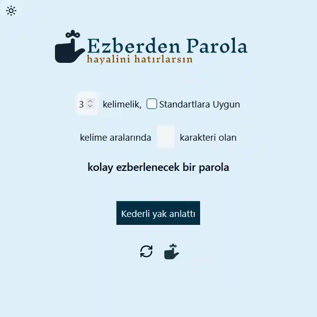

# Ezberden Parola

🔑 Şifreniz Hafızanızda

## Güvenli ve kullanımı kolay unutulmayan şifreler oluşturun

Türkçe'de kolay hatırlanabilen cümlelerden yola çıkarak çok güvenli şifreler oluşturun.

## Örneğin

### Düzensiz mavi alakarga i̇zleyecek

 veya uluslar-arası uyumlu

### Sadik-gunes-baligi-ve-kapsamli-guvercin-gitti

gibi cümleler, hem hatırlaması kolay hem de kırılması zor şifreler oluşturmanızı sağlar.

Bu yöntem, şifrelerinizi hem güvenli tutmanıza hem de kolayca hatırlamanıza yardımcı olur.

## Lisans

[LGPL-3.0](http://www.gnu.org/licenses/lgpl.html)

## Özellikler

- Kelime sayısı belirleme
- Türkçe karakter kaldırma
- Aralık belirleme

## Belgeler

[Üretilen Şifrelerin Kalitesini kontrol edebileceğiniz Test Platformu](<https://www.bennish.net/password-strength-checker/>)
